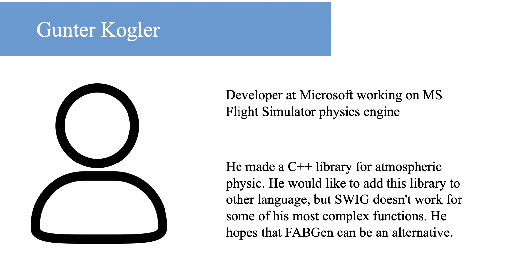
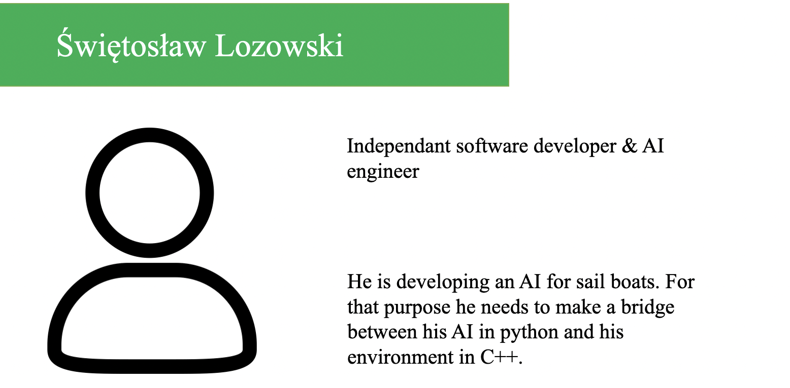
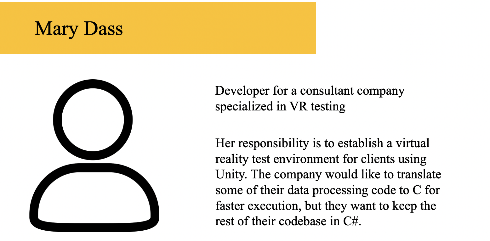

# Functional Specifications

## Context

### Problem

This project was proposed by Harfang a French company that makes
the Harfang3D engine.
Harfang3D is a lightweight
C++ 3D
rendering engine.  
 

Their current solution, which is based on C++, is highly efficient but
has a steep learning curve. This leads to longer development cycles for
the end user. It may even end up forcing the user to hire or retrain
their software engineer.  
In order to be more attractive and flexible,
Harfang needs to have support for
other languages.  
 

They made a binding system called
FABGen
which supports Python, LUA and Golang programming language.  
 

The client wants to add support for Rust in
FABGen.  
 

### Target and Stakeholders

Our Target is FABGen. The Stakeholders are ALGOSUP and Harfang.

### Concurrency

SWIG is an other existing, widely used, binding system for C and C++.
SWIG was not suited to the client needs as it was too old, The
availability of features may be limited based on the language selected.

Bindgen is the standard C/C++ to Rust binding tool, it might serve as a
stepping stone for the implementation of Rust into FABGen. Bindgen use a
different file format than FABGen to describe library so it is
unsuitable for the client use.

## Project scope

### In scope

FABGen is an open source software development tool that connects
programs written in C++ with a variety of high-level programming
languages. Currently FABGen supports LUA, Python and Go.  
Our objective is to add Rust support to FABGen.

### Out of scope

These are the features that were not necessary for a minimum viable
product. It does not mean that these features won’t be added.  
 

We could try to make the binding in such a way as to avoid
polymorphism at runtime. This would
be better for speed and safety, which are an important aspect of Rust,
however, it is not necessary for the minimum goal of the project.  
 

The project is to add Rust support, but if we have extra
time after completing the MVP and "no polymorphism" we could also
implement support for a new language. It would however be very time
consuming, and not required, which means that we would only start it
after everything else is implemented.

### Out of scope table

|                                              Features                                              | Reasons for rejection |    Date    |
|:--------------------------------------------------------------------------------------------------:|:---------------------:|:----------:|
| No polymorphism at runtime |    Not enough time    | 03/01/2023 |
|                                       Extra language binder                                        |    Not enough time    | 03/01/2023 |

## Personas

These are personas that represent potential users.

## Use case

-   The user has a C++ library they want to bind to Rust (or another
    language)

-   They write the python description file for their library

-   The Program generates the binding and headers for the targeted
    language

-   The user can now import his library into his language of choice

## Requirements

|                                              Feature                                               | Importance |
|:--------------------------------------------------------------------------------------------------:|:----------:|
|         Binding with Rust          | Mandatory  |
|                                        Validate unit tests                                         | Important  |
|                                          High reliability                                          | Important  |
| No polymorphism at runtime |  Optional  |
|                                        Working Rust example                                        |  Optional  |

### Binding with Rust

Binding a library to Rust means creating a way to call
this library’s functions from the Rust programming language.  
Binding allows communication between very low level programming
languages and higher level programming languages like C to Python which
have a simpler syntax and is easier to work with.

### Validate unit tests

FABGen
comes with a set of unit tests to validate that most features of a
language are properly implemented. We need to write a new set of tests
for Rust.

### High reliability

A major feature of Rust is memory safety and
reliability. It is very important that we keep both of these features
with our binding.  
 The Rust implementation must conform to
the standard syntax of the language and undergo extensive unit testing..

### No polymorphism at runtime

"Runtime polymorphism" refers to a program’s
ability to determine the necessary type at runtime to satisfy a
polymorphic interface. Depending on the programming language, this can
be relatively simple to implement. However, it can also lead to
decreased performance and reduced memory safety.

### Working Rust-Harfang example

To ensure that our binding is functional, we will need
to create a Rust project using our binding and a C++ library. This
project should use as many different functions and edge cases as
possible.  
To save time on development, this project will be a
Rust
version of a pre-existing, completed project.

## Timeline & Milestones

|        Deliverable        |    Date    |
|:-------------------------:|:----------:|
| Functional Specifications | 20/01/2023 |
|  Rust binding prototype   | 27/01/2023 |
| Technical Specifications  | 20/01/2023 |
|   Validated unit tests    | 10/02/2023 |
|       Rust example        | 14/02/2023 |

Their are also a number of smaller steps to reach our end goal.

-   Understand how Bindgen works.

-   Understand how FABGen works

-   Make unit test for Rust in FA

-   Make FABGen work to pass the unit test

-   Create a demonstration project using the binding

## Risks and Assumptions

### Risks

|                                                       Risk                                                       | Danger Level |      Mitigation      |
|:----------------------------------------------------------------------------------------------------------------:|:------------:|:--------------------:|
| Difficulty translating example project into Rust |    Medium    | Downsize the example |
|  Team needs more time to familiarise with Rust   |     High     |    Work overtime     |
|           FABGen can’t run on OSX Rust           |     High     |       Use a VM       |

### Assumptions

-   We can base ourselves on the Golang-FABGen implementation

-   Validating the unit tests makes our code cover all functions.
